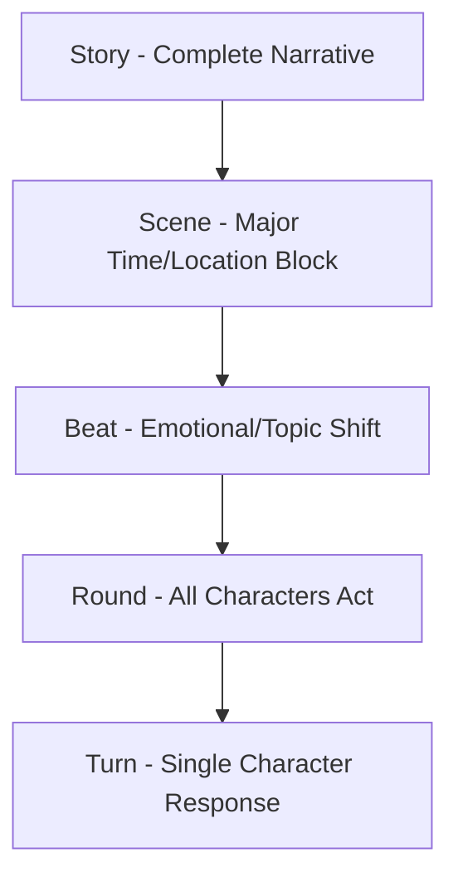
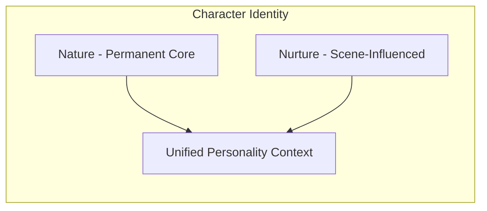
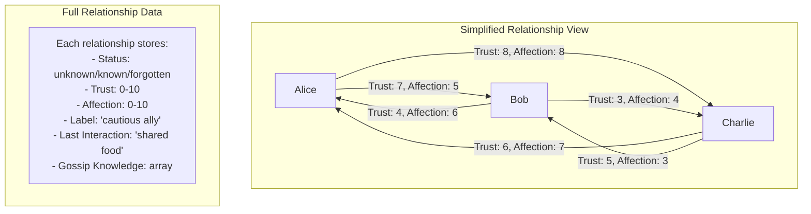
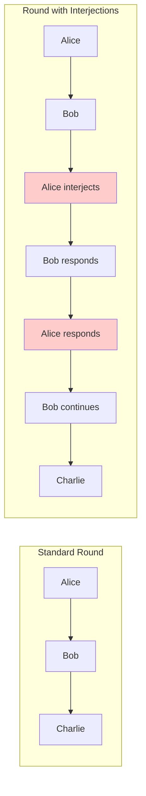
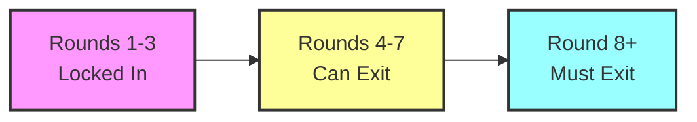
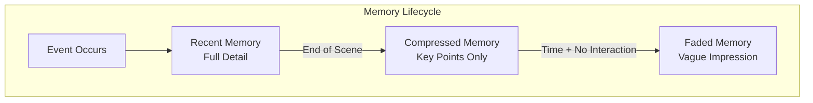
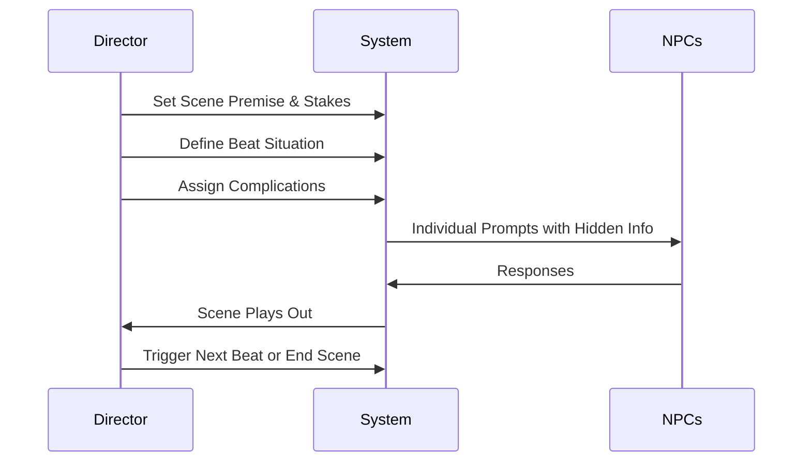
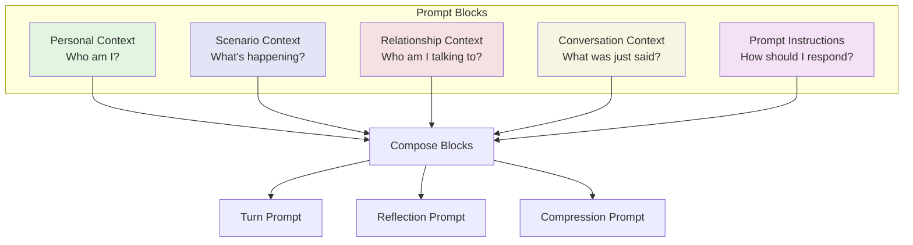
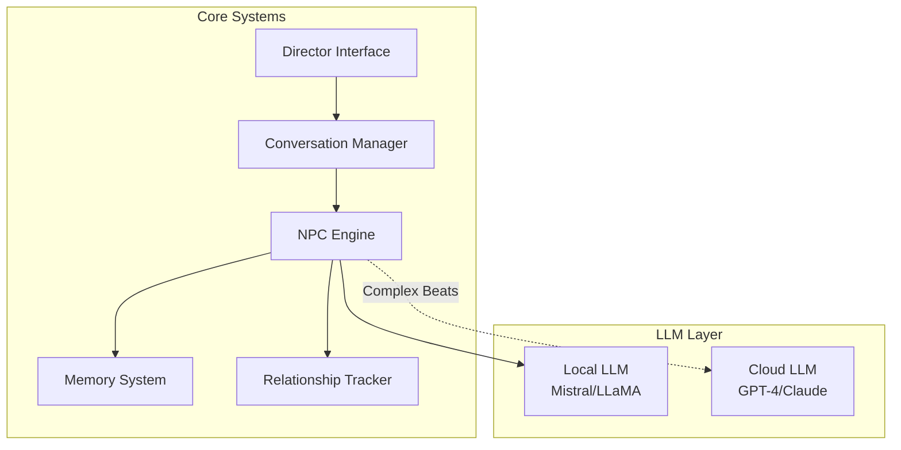
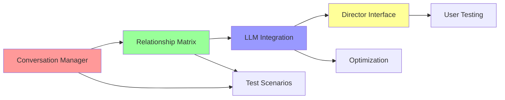

# LLM-Powered Village Simulator Design Document

## Core Concept
A village survival simulator where 3-5 NPCs are powered by LLMs, creating emergent narratives through conversational dynamics. Players act as directors, setting up scenes and situations while NPCs respond naturally based on their personalities, relationships, and hidden complications.

## Narrative Structure



### Terminology
- **Story**: The full narrative (e.g., "Surviving the Winter")
- **Scene**: Major story segment with a **Premise** and **Stakes**
- **Beat**: Subsection with a **Situation** and character **Complications**
- **Round**: One complete cycle where every character has acted
- **Turn**: Individual character's response

## Character Architecture

### Personality System



#### Nature (Permanent)
```javascript
{
  "Alice": {
    "core_traits": ["generous", "anxious", "hardworking"],
    "cognitive_style": "overthinking",
    "stress_response": "people-pleasing",
    "moral_compass": "fairness-first"
  }
}
```

#### Nurture (Evolves per Scene)
```javascript
{
  "Alice": {
    "recent_treatment": "appreciated",
    "current_confidence": 7,
    "learned_behaviors": ["Bob responds to guilt"],
    "temporary_beliefs": ["We might survive"],
    "social_mask": "competent leader"
  }
}
```

### Relationship Matrix



#### Complete Relationship Structure
```javascript
relationships = {
  "Alice->Bob": {
    // Relationship Status
    status: "known",              // "unknown", "known", "forgotten"
    
    // Core Metrics
    trust: 7,                     // 0-10: Will they do what they say?
    affection: 5,                 // 0-10: Do I enjoy their company?
    
    // Derived/Updated Fields
    label: "cautious ally",       // 2-word summary based on trust/affection
    
    // Memory
    last_interaction: "Bob shared food yesterday",
    historical_events: [          // Compressed over time
      "Bob helped gather wood (+2 trust)",
      "Bob lied about supplies (-3 trust)"
    ],
    
    // Information
    gossip_knowledge: [           // Things heard but not witnessed
      "Charlie says Bob hoards medicine",
      "Alice mentioned Bob seems tired"
    ]
  },
  
  "Alice->Charlie": {
    status: "unknown",            // Never actually met
    trust: null,
    affection: null,
    label: null,
    last_interaction: null,
    historical_events: [],
    gossip_knowledge: [           // Can have prejudices before meeting!
      "Bob says Charlie is trustworthy"
    ]
  }
}
```

## Conversation Flow System

### Turn Order with Interjection System



#### Turn Order Rules
1. **Base Order**: Alphabetical or director-specified (A → B → C)
2. **Interjection Limit**: Each character may interject **at most once** per round
3. **Interjection Response**: When interjected, the current speaker gets one response
4. **Chain Limit**: Maximum 3 exchanges per interjection (Interject → Respond → Counter)
5. **Resume Order**: After interjection resolves, continue with next character in base order

#### Implementation Structure
```javascript
class TurnManager {
  constructor(characters) {
    this.base_order = characters;  // ["Alice", "Bob", "Charlie"]
    this.current_round = 1;
    this.interjections_used = {};  // Track who has interjected this round
    this.current_speaker = 0;
    this.turn_history = [];
  }
  
  canInterject(character) {
    return !this.interjections_used[character] && 
           character !== this.getCurrentSpeaker();
  }
  
  handleInterjection(interjector, target) {
    // Mark interjection used
    this.interjections_used[interjector] = true;
    
    // Create interjection chain
    return [
      {speaker: interjector, type: "interjection"},
      {speaker: target, type: "response_to_interjection"},
      {speaker: interjector, type: "counter_response"},
      {speaker: target, type: "final_word"}
    ];
  }
  
  nextRound() {
    this.current_round++;
    this.interjections_used = {};  // Reset for new round
    this.current_speaker = 0;
  }
}
```

#### Interjection Triggers
NPCs decide to interject based on:
```javascript
interjection_factors = {
  emotional_trigger: {
    threshold: 8,  // Emotional state intensity
    examples: ["accused", "insulted", "praised unexpectedly"]
  },
  
  information_correction: {
    threshold: "falsehood detected",
    examples: ["That's not what happened", "I never said that"]
  },
  
  urgency: {
    threshold: "critical information",
    examples: ["Wait, the fire!", "I know where it is!"]
  },
  
  relationship_defense: {
    threshold: "trust > 7 with defended party",
    examples: ["Don't blame Alice!", "Bob's telling the truth"]
  }
}
```

#### Interjection Prompt Addition
Add to the PROMPT INSTRUCTION BLOCK when applicable:
```python
"""
=== PROMPT ===
{standard_prompt}

INTERJECTION OPTION:
You are observing {current_speaker} speak to {their_target}.
You may interject if you feel strongly about what was said.
Note: You can only interject ONCE this round. Use it wisely.

To interject, add to your response:
{
  "action": {...},
  "internal": {...},
  "wants_to_interject": true,
  "interjection_reason": "brief explanation"
}
"""
```

### Round-Based Conversation Control



## Memory System

### Memory Architecture



### Relationship Decay
- Relationships decay toward neutral (5/10) when characters don't interact
- Memories blur after 5+ days without interaction
- Old specific memories become general impressions

## Director Control System

### Scene Setup Flow



## Modular Prompt System

### Block Architecture



### Block Structure Overview
Each prompt is built from 5 clear blocks that can be independently modified and tested:

```python
def build_npc_prompt(npc, context):
    return f"""
{personal_context_block(npc)}

{scenario_context_block(context)}

{relationship_context_block(npc, context.speaking_to)}

{conversation_context_block(context)}

{prompt_instruction_block(context.round)}
"""
```

### 1. NPC Turn Prompt Blocks

#### PERSONAL CONTEXT BLOCK
```python
"""
=== PERSONAL CONTEXT ===
You are {name}.

Core Nature (permanent):
- Traits: {', '.join(nature.core_traits)}
- Stress Response: {nature.stress_response}
- Moral Compass: {nature.moral_compass}

Current State (from recent events):
- Emotional State: {emotional_state}
- Confidence: {nurture.current_confidence}/10
- Social Mask: Trying to appear {nurture.social_mask}
- Recent Treatment: Feeling {nurture.recent_treatment}

What You've Learned:
{format_learned_behaviors(nurture.learned_behaviors[-2:])}
"""
```

#### SCENARIO CONTEXT BLOCK
```python
"""
=== SCENARIO CONTEXT ===
SCENE: {scene.premise}
Stakes: {scene.stakes}

BEAT {beat_number}: {beat.situation}
Location: {beat.location}
Time: {beat.time}

Your Secret Complication:
[{npc.complication}]
Note: Others don't know this. Reveal through behavior or words as you see fit.

Present Characters: {', '.join(beat.characters)}
Witnesses: {', '.join(beat.witnesses)}
"""
```

#### RELATIONSHIP CONTEXT BLOCK
```python
"""
=== RELATIONSHIP CONTEXT ===
Speaking To: {speaking_to}

Your Relationship with {speaking_to}:
- Status: {relationship.status}
- Label: {relationship.label}
- Trust: {relationship.trust}/10
- Affection: {relationship.affection}/10

Last Direct Interaction:
{relationship.last_interaction or "First meeting"}

Historical Context:
{format_historical_events(relationship.historical_events[-3:])}

What You've Heard (Gossip):
{format_gossip(relationship.gossip_knowledge)}

Other Relationships Present:
{format_other_relationships(other_npcs)}
"""
```

#### CONVERSATION CONTEXT BLOCK
```python
"""
=== CONVERSATION CONTEXT ===
Current Round: {round_number}
Conversation Energy: {conversation_energy_status}

Recent Exchange:
{format_recent_turns(last_3_turns)}

Most Recent:
{speaking_to} said: "{last_line}"
Their tone: {last_tone}
Their action: {last_action or "none"}
"""
```

#### PROMPT INSTRUCTION BLOCK (Speaking Turn)
```python
"""
=== PROMPT ===
Respond as {name} to {speaking_to}'s last statement.

Consider:
- Your {primary_trait} nature influences your response style
- Your {relationship.trust}/10 trust affects how open you are
- Your complication may influence your behavior
{exit_availability_text if round >= 4}

Required Response Format:
{
  "action": {
    "speaks": "what you say",
    "does": "physical action (optional)",
    "tone": "your emotional tone"
  },
  "internal": {
    "emotional_state": "one_word",
    "wants_to_exit": boolean  // {exit_instruction}
  }
}
"""
```

#### PROMPT INSTRUCTION BLOCK (Observing Turn - Can Interject)
```python
"""
=== PROMPT ===
You are observing {current_speaker} speaking to {their_target}.
They just said: "{statement}"

You may INTERJECT if you feel strongly (only ONCE per round).
{f"You have already interjected this round." if already_interjected else ""}

Consider interjecting if:
- Someone is lying about facts you know
- Someone you trust (7+) is being unfairly attacked  
- Critical information needs immediate correction
- Your emotional state is heightened (8+) by what was said

Required Response Format:
{
  "observation": "internal thought about what you heard",
  "wants_to_interject": boolean,
  "interjection": {
    "speaks": "what you'd say if interjecting",
    "tone": "your interjection tone",
    "reason": "why this deserves your one interjection"
  } // only if wants_to_interject is true
}
"""
```

### 2. Beat Completion Reflection Blocks

#### PERSONAL CONTEXT BLOCK
```python
"""
=== PERSONAL CONTEXT ===
You are {name} with traits: {', '.join(nature.core_traits)}
Your moral compass: {nature.moral_compass}

Emotional Journey This Beat:
Started: {beat_start_emotion}
Ended: {beat_end_emotion}
"""
```

#### SCENARIO CONTEXT BLOCK
```python
"""
=== SCENARIO CONTEXT ===
Beat Summary: {beat.situation}
What Happened:
{format_beat_events()}

Your Complication Was: [{npc.complication}]
Did you reveal it? {revelation_status}
"""
```

#### RELATIONSHIP CONTEXT BLOCK  
```python
"""
=== RELATIONSHIP CONTEXT ===
Characters Involved This Beat:
{format_participants_before_beat()}

Key Interactions:
{format_key_exchanges()}
"""
```

#### CONVERSATION CONTEXT BLOCK
```python
"""
=== CONVERSATION CONTEXT ===
Not applicable for beat reflection.
"""
```

#### PROMPT INSTRUCTION BLOCK
```python
"""
=== PROMPT ===
Reflect on how this beat affected your relationships and knowledge.

For each character involved:
- How did trust change? (-3 to +3)
- How did affection change? (-3 to +3)
- What's your key memory?
- Two-word relationship label?

What did you learn?

Required Response Format:
{
  "relationships": {
    "[name]": {
      "label": "two words",
      "trust_delta": number,
      "affection_delta": number,
      "beat_memory": "one sentence"
    }
  },
  "knowledge_gained": {
    "facts": ["array of facts"],
    "suspicions": ["array of suspicions"],
    "gossip_worthy": ["array of gossip"]
  }
}
"""
```

### 3. Scene Memory Compression Blocks

#### PERSONAL CONTEXT BLOCK
```python
"""
=== PERSONAL CONTEXT ===
You are {name}.
Core traits that affect what you remember: {', '.join(nature.core_traits)}
"""
```

#### SCENARIO CONTEXT BLOCK
```python
"""
=== SCENARIO CONTEXT ===
Scene That Just Ended: {scene.premise}
Stakes Were: {scene.stakes}
Outcome: {scene.resolution}

Complete Event Log:
{format_all_scene_events()}
"""
```

#### RELATIONSHIP CONTEXT BLOCK
```python
"""
=== RELATIONSHIP CONTEXT ===
People Involved: {', '.join(scene.all_participants)}

Relationship Changes This Scene:
{format_relationship_deltas()}
"""
```

#### CONVERSATION CONTEXT BLOCK
```python
"""
=== CONVERSATION CONTEXT ===
Total Conversations: {scene.total_beats}
Most Emotional Moment: {scene.peak_emotion}
"""
```

#### PROMPT INSTRUCTION BLOCK
```python
"""
=== PROMPT ===
Compress your memories from this scene. You can only keep:
- 3 specific moments (one sentence each)
- 2 general impressions about people
- 1 lesson learned

Everything else becomes fuzzy or forgotten.

Required Response Format:
{
  "specific_memories": [
    "moment 1",
    "moment 2", 
    "moment 3"
  ],
  "general_impressions": [
    "feeling about person 1",
    "feeling about person 2"
  ],
  "lesson": "what you learned"
}
"""
```

### 4. Director Scene Prompt Format

```
SCENE {number}: {title}
Premise: {what's happening and why}
Stakes: {what could go wrong}

BEAT 1
Characters: [Alice, Bob, Charlie]
Situation: {immediate challenge}
Complications:
  Alice: [secret problem or knowledge]
  Bob: [different secret]
  Charlie: [another secret]
```

### Block Composition System

The modular blocks can be composed programmatically for different contexts:

```python
class PromptBuilder:
    def __init__(self):
        self.blocks = {
            'personal': PersonalContextBlock(),
            'scenario': ScenarioContextBlock(),
            'relationship': RelationshipContextBlock(),
            'conversation': ConversationContextBlock(),
            'prompt': PromptInstructionBlock()
        }
    
    def build_turn_prompt(self, npc, context):
        """Standard NPC turn during conversation"""
        return self.compose([
            self.blocks['personal'].build(npc),
            self.blocks['scenario'].build(context),
            self.blocks['relationship'].build(npc, context.speaking_to),
            self.blocks['conversation'].build(context),
            self.blocks['prompt'].build_turn_instruction(context.round)
        ])
    
    def build_reflection_prompt(self, npc, beat_data):
        """Beat completion reflection"""
        return self.compose([
            self.blocks['personal'].build(npc),
            self.blocks['scenario'].build_beat_summary(beat_data),
            self.blocks['relationship'].build_participants(beat_data),
            # Skip conversation context for reflection
            self.blocks['prompt'].build_reflection_instruction()
        ])
    
    def build_compression_prompt(self, npc, scene_data):
        """Scene memory compression"""
        return self.compose([
            self.blocks['personal'].build_minimal(npc),  # Just traits
            self.blocks['scenario'].build_scene_summary(scene_data),
            self.blocks['relationship'].build_changes(scene_data),
            self.blocks['conversation'].build_stats(scene_data),
            self.blocks['prompt'].build_compression_instruction()
        ])
    
    def compose(self, blocks):
        """Join blocks with clear separation"""
        return "\n\n".join(filter(None, blocks))
```

### Block Customization Examples

```python
# Customize for high-stress situations
def build_crisis_prompt(npc, context):
    personal = personal_block(npc)
    personal += "\nCRISIS MODE: Your stress response is heightened."
    
    scenario = scenario_block(context)
    scenario += "\nURGENCY: Immediate decision required."
    
    # Rest remains standard...
    
# Customize for first meetings
def build_first_meeting_prompt(npc, context):
    relationship = "=== RELATIONSHIP CONTEXT ===\n"
    relationship += f"First Meeting with {context.speaking_to}\n"
    relationship += f"Gossip you've heard: {npc.gossip_about[context.speaking_to]}\n"
    
    # Rest remains standard...
```

### Benefits of Block System

1. **Modularity**: Each block can be updated independently
2. **Testability**: Blocks can be unit tested in isolation  
3. **Reusability**: Same blocks compose different prompt types
4. **Clarity**: Clear separation of concerns
5. **Debugging**: Easy to identify which block causes issues
6. **Customization**: Blocks can be modified for special situations
7. **Consistency**: Same information always formatted the same way

## Example Scene Flow

### Scene Setup (Director)
```
SCENE 1: The Missing Food
Premise: The food storage was raided overnight
Stakes: Find the thief or the group falls apart from suspicion

BEAT 1
Characters: [Alice, Bob, Charlie]
Situation: Discovering the empty storage at dawn
Complications:
  Alice: [You saw someone near storage but couldn't tell who]
  Bob: [You sleep-walked last night and don't remember]
  Charlie: [You took it but regret it immediately]
```

### Turn Example (Alice)
```json
{
  "action": {
    "speaks": "This is a disaster. We barely had enough as it was.",
    "does": "checks the storage again desperately",
    "tone": "panicked"
  },
  "internal": {
    "emotional_state": "anxious",
    "wants_to_exit": false
  }
}
```

### Beat Completion (Charlie's Reflection)
```json
{
  "relationships": {
    "Alice": {
      "label": "suspicious leader",
      "trust_delta": -1,
      "affection_delta": 0,
      "beat_memory": "Alice immediately looked at me when food went missing"
    },
    "Bob": {
      "label": "fellow suspect",
      "trust_delta": 0,
      "affection_delta": 1,
      "beat_memory": "Bob also seemed confused about the missing food"
    }
  },
  "knowledge_gained": {
    "facts": ["Storage was definitely accessed at night"],
    "suspicions": ["Alice might suspect me specifically"],
    "gossip_worthy": ["Bob mentioned being tired lately"]
  }
}
```

## Implementation Architecture

### System Components



### State Management

```javascript
class GameState {
  constructor() {
    this.story = {
      current_scene: 1,
      current_beat: 1,
      total_days: 0
    };
    
    this.npcs = {
      "Alice": { nature: {...}, nurture: {...} },
      "Bob": { nature: {...}, nurture: {...} },
      "Charlie": { nature: {...}, nurture: {...} }
    };
    
    this.relationships = {
      // Bidirectional relationship matrix
    };
    
    this.conversation = {
      current_round: 0,
      participants: [],
      turn_history: [],
      exit_requests: {}
    };
    
    this.resources = {
      food: 10,
      wood: 10,
      morale: 50
    };
  }
}
```

## Key Design Principles

1. **Hidden Information**: Complications are never shared between NPCs, only revealed through behavior
2. **Bidirectional Relationships**: A→B trust ≠ B→A trust, creating natural misunderstandings
3. **Memory Compression**: Forces interesting choices about what to remember
4. **Controlled Conversations**: Round limits prevent infinite dialogue loops
5. **Director as Orchestrator**: Player sets situations, not outcomes
6. **Nature vs Nurture**: Core traits persist while learned behaviors adapt
7. **Emergent Drama**: Conflict arises from information asymmetry and relationship dynamics
8. **Strategic Interjections**: One interjection per round creates tactical conversation dynamics

## Interjection System Benefits

### Emergent Conversation Patterns
- **The Defender**: Uses interjections to protect allies
- **The Corrector**: Interjects to fix false information  
- **The Emotional**: Wastes interjection on minor slights
- **The Strategic**: Saves interjection for critical moments

### Why This System Works
- **Prevents Conversation Monopoly**: Can't spam interjections
- **Creates Tactical Decisions**: Is this worth my one interjection?
- **Natural Drama**: Defensive interjections reveal relationships
- **Maintains Flow**: Max 4 extra turns per interjection keeps pace
- **Personality Expression**: When/why NPCs interject reveals character

## Next Steps - Implementation Roadmap

### Phase 1: Core Conversation Engine (Week 1)
**Goal: Prove the conversation system works with 3 NPCs**

#### 1.1 Build Conversation Manager
```python
# Start with this exact class - it's your MVP
class ConversationManager:
    def __init__(self):
        self.characters = ["Alice", "Bob", "Charlie"]
        self.current_round = 0
        self.turn_order = []
        self.interjections_used = {}
        self.conversation_history = []
    
    # Core methods to implement:
    # - start_round()
    # - get_next_speaker()  
    # - handle_interjection()
    # - should_force_exit()
```

**Success Criteria:**
- [ ] Can manage 3 NPCs through 8 rounds
- [ ] Interjection system works correctly
- [ ] Conversation exits trigger properly
- [ ] Turn history is tracked accurately

#### 1.2 Implement Basic NPC State
```python
# Minimal viable NPC - just enough to test conversations
class NPC:
    def __init__(self, name, traits):
        self.name = name
        self.nature = {"core_traits": traits}
        self.nurture = {"emotional_state": "neutral"}
        self.relationships = {}  # Start empty
```

**Test Scenario 1: "The Accusation"**
- Alice accuses Bob of stealing
- Charlie knows the truth
- Test if Charlie interjects appropriately

### Phase 2: Relationship Dynamics (Week 1-2)
**Goal: Validate the trust/affection system creates meaningful drama**

#### 2.1 Implement Relationship Matrix
```python
# The bidirectional relationship structure
def initialize_relationships():
    return {
        "Alice->Bob": {"trust": 5, "affection": 5, "label": "stranger"},
        "Bob->Alice": {"trust": 5, "affection": 5, "label": "stranger"},
        # ... all 6 relationships
    }

# Test the math:
# - Does trust 7 + affection 3 = "reliable but cold"?
# - Does trust 3 + affection 8 = "charming liar"?
```

#### 2.2 Test Relationship Scenarios
**Scenario A: Trust Asymmetry**
- Set: Alice trusts Bob (8), Bob doesn't trust Alice (3)
- Complication: Alice[has medicine], Bob[needs medicine]
- Expected: Alice offers help, Bob suspicious of motives

**Scenario B: Affection Without Trust**  
- Set: Charlie likes Bob (affection 8), doesn't trust him (trust 2)
- Event: Bob asks Charlie to lie for him
- Expected: Charlie refuses but feels bad

**Success Metrics:**
- [ ] Relationship changes feel appropriate (-3 to +3 range)
- [ ] Labels match trust/affection scores
- [ ] Asymmetry creates interesting dynamics

### Phase 3: LLM Integration & Optimization (Week 2)
**Goal: Get quality responses in <200 tokens per turn**

#### 3.1 Local LLM Setup
```bash
# Recommended setup for testing
ollama pull mistral:7b  # Start here - good balance
ollama pull llama3.2:3b  # Fallback for speed
```

#### 3.2 Prompt Optimization Tests
```python
# Measure tokens for each block:
def measure_prompt_blocks():
    contexts = {
        "personal": 45,      # Target
        "scenario": 35,      # Target  
        "relationship": 40,   # Target
        "conversation": 30,   # Target
        "prompt": 30          # Target
    }
    # Total target: ~180 tokens
```

**Optimization Techniques:**
1. **Use abbreviations**: "Trust:7" not "Your trust level is 7 out of 10"
2. **Remove redundancy**: Don't repeat character names in each block
3. **Compress lists**: "Bob,Charlie present" not "Bob is here, Charlie is here"
4. **Template responses**: Pre-structure JSON format

#### 3.3 Response Quality Tests
Test each NPC archetype responds appropriately:
- **Anxious character**: Should overthink, worry, seek reassurance
- **Selfish character**: Should prioritize self, deflect blame
- **Generous character**: Should offer help, trust easily

### Phase 4: Director Interface (Week 2-3)
**Goal: Non-programmers can run scenes**

#### 4.1 Minimum Viable UI
```
+------------------------+
| SCENE SETUP            |
|------------------------|
| Premise: [text box]    |
| Stakes: [text box]     |
| [Start Scene]          |
+------------------------+

+------------------------+
| BEAT CONTROL           |
|------------------------|
| Situation: [text box]  |
| Complications:         |
|  Alice: [text box]     |
|  Bob: [text box]       |
|  Charlie: [text box]   |
| [Start Beat]           |
+------------------------+

+------------------------+
| CONVERSATION VIEW      |
|------------------------|
| [Round 2 of 8]         |
| Alice: "Bob never..."  |
| Bob: "That's not..."   |
| > Charlie interjects!  |
| Charlie: "Actually..." |
| [Continue] [End Beat]  |
+------------------------+
```

#### 4.2 Critical UI Features
- **Real-time conversation display** with speaker labels
- **Interjection highlighting** (different color/style)
- **Round counter** with exit availability indicator
- **Quick complication editor** for on-the-fly adjustments
- **Export scene log** for sharing stories

### Testing Checklist

#### Week 1 Validation
- [ ] 3 NPCs can complete an 8-round conversation
- [ ] Interjections trigger appropriately
- [ ] Relationships update after each beat
- [ ] Memory compression works at scene end

#### Week 2 Validation  
- [ ] Local LLM responds in <500ms
- [ ] Prompts stay under 200 tokens
- [ ] NPCs behave according to traits
- [ ] Hidden complications affect behavior appropriately

#### Week 3 Validation
- [ ] Non-technical user can run a scene
- [ ] Stories are shareable/memorable
- [ ] System handles edge cases gracefully
- [ ] 5 complete scenes run without crashes

### Critical Path Dependencies



### Risk Mitigation

**If LLM responses are too slow:**
- Pre-generate common responses
- Use smaller model for simple turns
- Cache similar situations

**If relationships feel mechanical:**
- Add more gossip/suspicion mechanics
- Increase complication variety
- Add relationship-specific memories

**If conversations feel repetitive:**
- Expand emotional state variety
- Add more turn actions ("storms off", "whispers")
- Increase situation diversity

### Success Metrics for POC

**Technical Success:**
- 100 complete conversations without crash
- <500ms average response time
- <$0.01 per conversation cost

**Narrative Success:**
- 10 unique stories from same scenario
- Players share conversation screenshots
- Relationships evolve meaningfully

**Ready to Ship When:**
- Director can run scene in <2 minutes setup
- 3 different personality types behave distinctly
- Interjection creates "wow" moment in demos